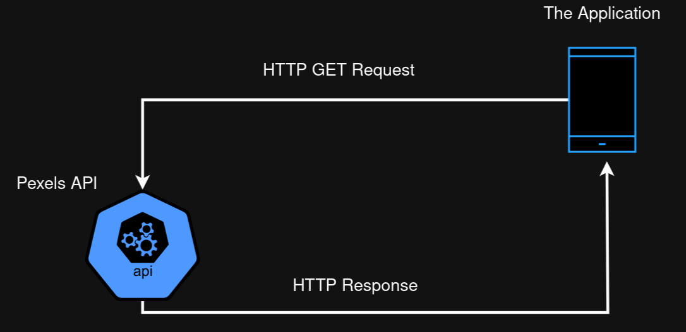

<h1 style="text-align: center">Pexel Repo</h1>

  

### Android app to download free Wallpapers & Videos

  

### How it works

This application depends on fetching data from www.pexels.com API.

 

 

- It is written in Java, and sends the HTTP request and Getting response using OKHTTP3 dependency.
- The data comes in JSON format.
- I create Java parsers that converts JSON data into Java Objects that ease displaying the data into the GUI.
