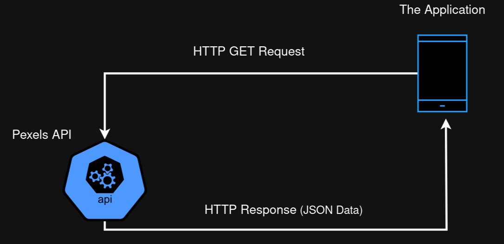
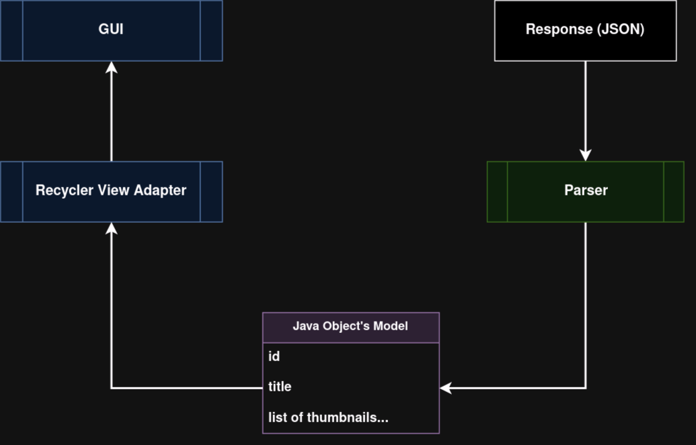
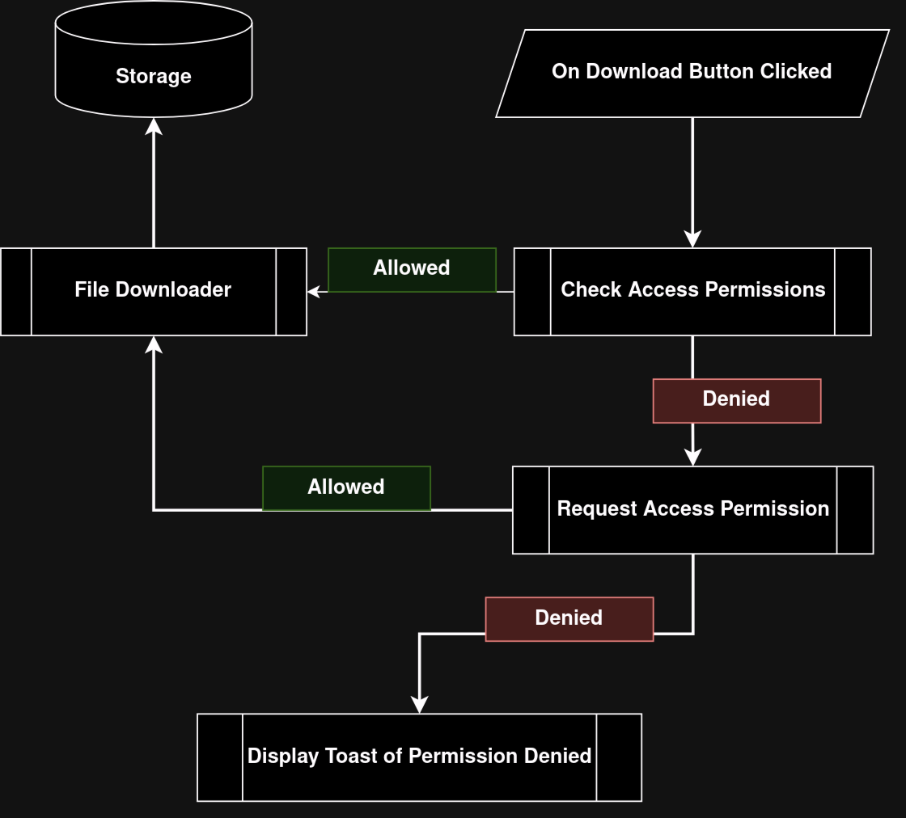
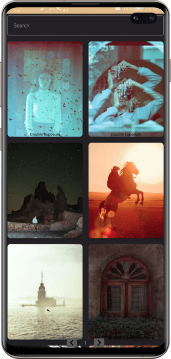
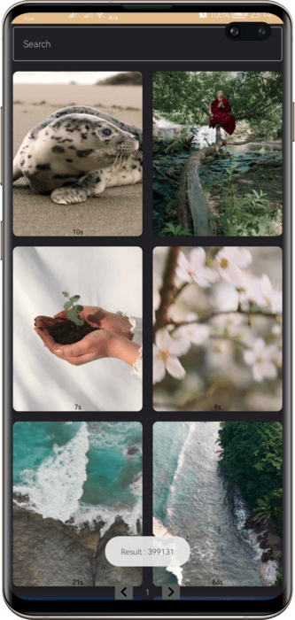

```

██████╗░███████╗██╗░░██╗███████╗██╗░░░░░  ██████╗░███████╗██████╗░░█████╗░
██╔══██╗██╔════╝╚██╗██╔╝██╔════╝██║░░░░░  ██╔══██╗██╔════╝██╔══██╗██╔══██╗
██████╔╝█████╗░░░╚███╔╝░█████╗░░██║░░░░░  ██████╔╝█████╗░░██████╔╝██║░░██║
██╔═══╝░██╔══╝░░░██╔██╗░██╔══╝░░██║░░░░░  ██╔══██╗██╔══╝░░██╔═══╝░██║░░██║
██║░░░░░███████╗██╔╝╚██╗███████╗███████╗  ██║░░██║███████╗██║░░░░░╚█████╔╝
╚═╝░░░░░╚══════╝╚═╝░░╚═╝╚══════╝╚══════╝  ╚═╝░░╚═╝╚══════╝╚═╝░░░░░░╚════╝░

```

<br><br>

## About the application

<div align="center">
    <b>
        Our application developed with Java and Android Studio, Its role is to download free wallpapers and videos with high quality without `copy right`. It depends on fetching data from Pexels api with authorization and display it in nice UI.
    </b>
</div>

<br>

- www.pexels.com is a popular website that provides a vast collection of free stock photos and videos. They also offer an API (Application Programming Interface) that allows developers to access and use their media library programmatically in their own applications or websites.

- The Pexels API provides a way to search for photos and videos based on various parameters such as keywords, categories, colors, and popular searches. It also allows you to retrieve details about individual media items, including their download URLs, dimensions, and licensing information.

<br><br><br>

# Table of content

- [Installation](#installation)
- [Usage](#usage)
- [Infrastucture](#infrastructue)
- [Screenshots](#screenshots)
- [Contribution](#contribution)
- [Related projects](#related-projects)
- [Licensing](#licensing)

<br><br><br>

## Installation

<b>Our application is published on Google Play Store you can get it from next link.</b>

[PexelRepo](https://play.google.com/store/apps/details?id=com.sharpminded.pexelrepo)

<br><br>

## Usage

<b>
    You can download high quality wallpapers and videos for free if used for personal usage.<br>
    This application just for Android Users.
</b>

<br><br>

## Infrastructue

#### The general idea

<br>



<br>

#### Displaying the data process

<br>



<br>

#### Downloading image or video

<br>



<br><br>

## Screenshots

<br>


<br>



<br>



<br><br>

## Contribution

<br>

- [Abdelemjid Essaid](https://github.com/abdelemjidessaid) The creator of project completly.

<br><br>

## Related projects

In this project we worked on API, which is related to the [Api](https://intranet.alxswe.com/projects/269) , [JavaScript - Web scraping](https://intranet.alxswe.com/projects/333) and [Api Advanced](https://intranet.alxswe.com/projects/314) Projects, depends on gattering data from the an api and display it to the user.

## Licensing

All rights reserved for the user [Abdelemjid Essaid](https://github.com/abdelemjidessaid) 2023.
